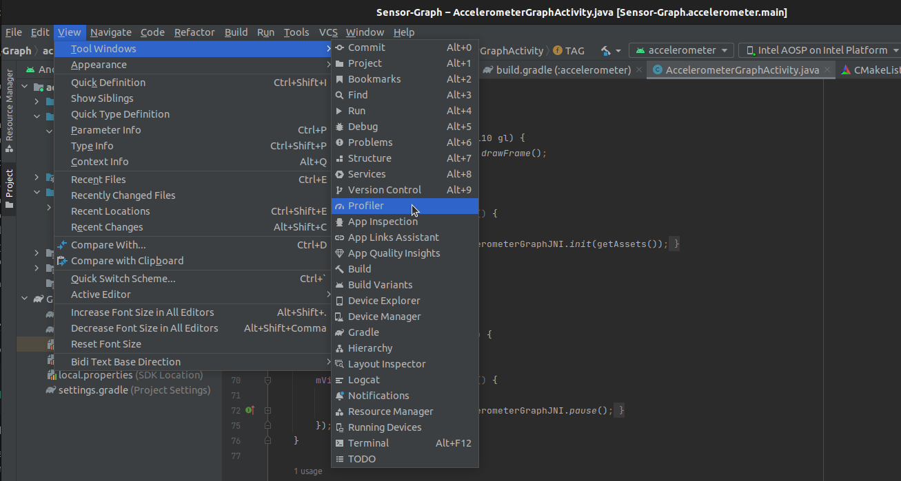

# Android Memory Profiler

* The Memory Profiler is a component in the Android Profiler that helps you identify memory leaks and memory churn that can lead to stutter, freezes, and even app crashes. It shows a realtime graph of your app's memory use and lets you capture a heap dump, force garbage collections, and track memory allocations.
*  Android Studio Version: 3.0+

## Quickstart
* To open the Memory Profiler, follow these steps:
    1. Insall **Android Studio** on your develop host device.
    2. Open **Android Studio**.  
    3. Click **View > Tool Windows > Profiler**.  
    

  

    The **Android Studio** is as shown in the figure below. At this time, no process to be monitored has been added.  
    

   
    4. After the application has launched, click the **+** button on the **SESSIONS** panel. Select the device and app process you want to profile from the Android Profiler toolbar.  
       (If you've connected a device over USB but don't see it listed, ensure that you have enabled USB debugging in the **Developer Option**).  
    

  
    

    5. Click anywhere in the MEMORY timeline to open the Memory Profiler.  
    Now, you can monitor the memory status of the application:
    

    The detail categories in the memory count are as follows:  

    * **Java**: Memory from objects allocated from Java or Kotlin code.  
    * **Native**: Memory from objects allocated from C or C++ code.  
    * **Graphics**: Memory used for graphics buffer queues to display pixels to the screen, including GL surfaces, GL textures, and so on. 
    * **Stack**: Memory used by both native and Java stacks in your app. This usually relates to how many threads your app is running.

    * **Code**: Memory that your app uses for code and resources, such as dex bytecode, optimized or compiled dex code, .so libraries, and fonts.

    * **Others**: Memory used by your app that the system isn't sure how to categorize.

    * **Allocated**: The number of Java/Kotlin objects allocated by your app. This does not count objects allocated in C or C++.  

   So from the above figure, we could konw what types of objects were allocated and how much space they use.  
   When we analyze memory related issues, the **Java** and **Native** type usally contain the key infomation.
* Note: Android 8.0 and higher includes an on-device profiling tool that keeps track of all allocations, so this number always represents the total number of Java objects outstanding in your app on Android 8.0 and higher.

## Use Memory Profiler to dump memory info
While using the Memory Profiler, you should stress your app code and try forcing memory leaks. One way to provoke memory leaks in your app is to let it run for a while before inspecting the heap. Leaks might trickle up to the top of the allocations in the heap. However, the smaller the leak, the longer you need to run the app in order to see it.  

### Capture a heap dump
* Request to **GC**(garbage collection): Trash can button, force GC operation (Force garbage collection), you can also use the **Ctrl + G** shortcut key.
    

* To capture a heap dump, click **Capture heap dump**, then select **Record** at a specific point in time. (First click the **GC** icon to recyle the memory, and then dump a memory snapshot)
    

* Time scaling: The **+** sign and **-** buttons to zoom in/out of the timeline.
    

### Memory Snapshot Analysis

* In the memory snapshot in the below figure, all currently running memory objects are reflected.
    

* Choose to view objects by package: In the class arrangement options, select the "Arrange by package" option, so that you can find which objects are in the memory in a more orderly manner.
    

In the list of classes, you can see the following information:  
* Allocations: Number of allocations in the heap.
* Native Size: Total amount of native memory used by this object type (in bytes).
* Shallow Size: Total amount of Java memory used by this object type (in bytes).
* Retained Size: Total size of memory being retained due to all instances of this class (in bytes).

From the table, we could see that the **Bitmap** occupies most of the memory space. So next step we could invesgate the related code in our app or system.

## Reference Document
* Android Profiler: https://developer.android.com/studio/profile/memory-profiler
* https://cloud.tencent.com/developer/article/2247066