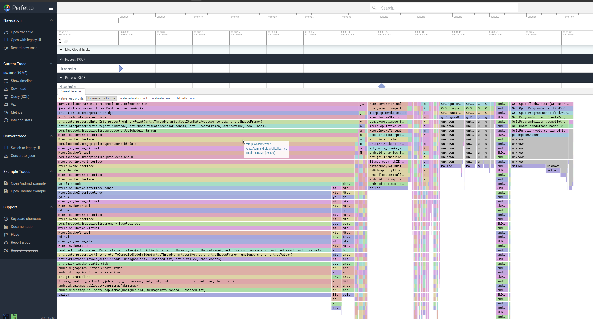

# Heapprofd

Heapprofd is a tool that tracks heap allocations & deallocations of an Android process within a given time period.
The resulting profile can be used to attribute memory usage to particular call-stacks, supporting a mix of both native and java code.  
The tool can be used by Android platform and app developers to investigate memory issues.
Target platform: Android 10+

## Target processes
On userdebug builds, all processes except for a small blacklist of critical services can be profiled. This restriction can be lifted by disabling SELinux by running **adb shell su root setenforce 0** or by passing **--disable-selinux** to the heap_profile script.   
On "user" builds, you can only use it on apps with the debuggable or profileable manifest flag.  
 
| Process Type           |userdebug(setenforce 0)| userdebug | user |   
| :--------------------: | :------------------: | :-------: | :--: |
| critical native service| y                    | n         | n    |    
| native service         | y                    | y         | n    |  
| app                    | y                    | y         | y    |  
| profileable app	     | y                    | y         | y    |  
| debugable app	         | y                    | y         | y    |  

## Quickstart
Use the **heap_profile** script to heap profile a process.(**heap_profile** is a script to use **Heapprofd**)
1. Download _**heap_profile**_ script:
    ```shell
    curl -LO https://raw.githubusercontent.com/google/perfetto/master/tools/heap_profile
    chmod +x heap_profile
    ```
2. Use **headp_profile** to dump memory usage  

    Before using the tool, you need to make sure adb is installed on your host device and confirm the target Android device is successfully connected by adb.
    You can target processes either by name (-n com.example.myapp) or by PID (-p 1234).   
    In the first case, the heap profile will be initiated on both on already-running processes that match the package name   and new processes launched after the profiling session is started.
    ```shell
    adb connect target_device_ip
    mkdir output
    ./heap_profile -n com.smile.gifmaker -o output    ## kuaishou app process name: com.smile.gifmaker
    ```
    If terminal output info like bellow, it means it is running.
    ```
    Profiling active. Press Ctrl+C to terminate.
    You may disconnect your device.
    ```
    At this time, perform corresponding operations on the target app to trigger a memory leak.  
    And then press CTRL+C to finish the recording. The terminal window will output info like bellow:
    ```
    ^C Waiting for profiler shutdown...
    Wrote profiles to /tmp/01eb60 (symlink /tmp/heap_profile-latest)
    The raw-trace file can be viewed using https://ui.perfetto.dev.
    The heap_dump.* files can be viewed using pprof/ (Googlers only) or https://www.speedscope.app/.
    The two above are equivalent. The raw-trace contains the union of all the heap dumps.
    ```
    And the **raw_trace** file could be seen in the **output** directory.

## Continuous dumps  
 Above operation would only include one time heap dump info.  
To get more heap info and watch the memory change trends, it is better to add _-c time_ms_ param to realize continuous dump:   

```shell
./heap_profile -n com.smile.gifmaker -c 1000 -o output  ## Continous dumping heap info every 1 second 
``` 
For more heap_profile configurations, please refer https://perfetto.dev/docs/reference/heap_profile-cli  
**Note**: heap_profile can only record the memory situation during its operation, but cannot record the situation before heap_profile is run.

##  Viewing results on Perfetto UI
You can use the [Perfetto UI][perfetto_ui] to visualize heap dumps. 
1. Upload the raw-trace file in your output directory. You will see all heap dumps as diamonds on the timeline, click any of them to get a flamegraph.
<div align=center></div>


2. Click "Open trace file" to open the generated **raw_trace** file above.  
<div align=center></div>

## Analyze the flamegraphs
Each diamond corresponds to a snapshot of the allocations and callstacks collected at that point in time.
<div align=center></div>

The resulting profile proto contains four views on the data, for each diamond.  
<div align=center></div>

| Type | Description |
|------|-------------|
|   Unreleased malloc size   | how many bytes were allocated but not freed at this callstack, from the moment the recording was started until the timestamp of the diamond.            |
| Total malloc size     |      how many bytes were allocated (including ones freed at the moment of the dump) at this callstack, from the moment the recording was started until the timestamp of the diamond.       |
|   Unreleased malloc count   |    how many allocations without matching frees were done at this callstack, from the moment the recording was started until the timestamp of the diamond.        |  
|   Total malloc count   |   how many allocations (including ones with matching frees) were done at this callstack, from the moment the recording was started started until the timestamp of the diamond.|  


In order to locate memory leaks, the easiest way is to look at the Unreleased malloc count. That is, how many allocations are there that have not called free.
    Compare the memory at different time by clicking on the dimond.(Continuous dumps every second)
    You can see that the memory in the first large block keeps rising. Combine it with the stack and analyze and solve it.
    Sometimes the leakage is very small and difficult to see. You can repeat the operation many times and compare the data before and after.
<div align=center></div>   

When click the 1 diamond, we could see the Unreleased malloc size is 229.28M  
<div align=center></div>  

And click the 2 diamond, the Unreleased malloc size rise to 518.73 MB. 
<div align=center></div>  
Just about 4 seconds, the unrelased increases about 290MB.   
So we could suspect teh process likely has memory leak. So we could continue analyze the call statck to see where the memory is malloced.  

<div align=center></div>  
 From the call stack we could see the app related function: 

<div align=center></div>  
Then view the code as follows:

```Java
# This is just a sample code to help us understand the tool.
@Override
public void onDrawFrame(GL10 gl) {
    AccelerometerGraphJNI.drawFrame();
    addNativeLeak();
}
```

```Java
List<Bitmap> nativeLeakList = new ArrayList<Bitmap>(); //the nativeLeakList is not released until process exited.

String TAG = "OOM_TEST";
public void addNativeLeak() {
    int width = 640;
    int height = 480;
    #From Android 8, Bitmap memory is alloced in naitive heap, not java heap.
    Bitmap bitmap = Bitmap.createBitmap(width, height, Bitmap.Config.ARGB_8888);

    double pictureSize = bitmap.getByteCount() * 1.0/ 1024/ 1024;
    if (android.os.Build.VERSION.SDK_INT >= android.os.Build.VERSION_CODES.KITKAT) {
        double bitmapSize = bitmap.getAllocationByteCount() * 1.0 / 1024 / 1024;
        Log.i(TAG, "bitmap size: " + bitmapSize + " mB" + " ,picture size: " + pictureSize + " mB"); //equal 1.17M vm space in native heap
    }
    nativeLeakList.add(bitmap);
}
```
In the above sample code, the Bitmap is continously alloced and not released. So we could find the code locatio that caused the memory leak.  

[perfetto_ui]: https://ui.perfetto.dev
